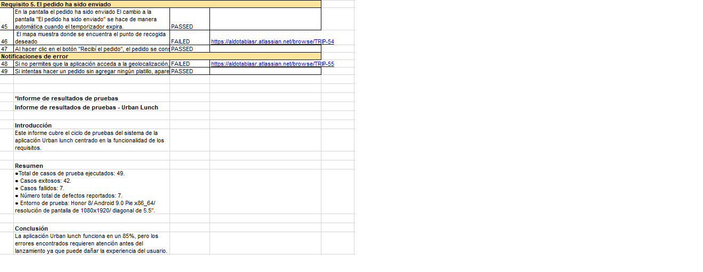

# Portafolio de Proyectos – QA Engineer  
**Aldo Tablas**

Este repositorio contiene mi portafolio de proyectos desarrollados durante el
bootcamp de **QA Engineer en TripleTen**. Aquí se presentan ejemplos de pruebas
manuales realizadas sobre aplicaciones web y móviles, incluyendo análisis de
requisitos, documentación de pruebas y reportes de errores.

---

## Proyecto 1: Pruebas de aplicación web  
**Proyecto de Bootcamp – TripleTen**

### Contexto del proyecto
Este proyecto consistió en el aseguramiento de calidad de una aplicación web
orientada a la **reserva y uso compartido de automóviles**. El objetivo principal
fue validar el correcto funcionamiento de las funcionalidades clave del sistema
antes de su liberación.

Las pruebas se realizaron en distintos navegadores y resoluciones para asegurar
un comportamiento consistente en diferentes entornos.

---

### Análisis
Se llevó a cabo un análisis detallado de los **requisitos funcionales** y de los
**diseños en Figma**, priorizando la documentación de los requisitos cuando se
detectaron inconsistencias entre la documentación y el diseño.

A partir de este análisis se elaboraron:
- Listas de comprobación (checklists) para validar el formulario de reserva  
- Casos de prueba para funcionalidades clave  
- Escenarios positivos y negativos para el flujo de reserva  

---

### Conclusiones
La ejecución de las pruebas permitió identificar defectos funcionales y de
usabilidad que podían afectar la experiencia del usuario. Los problemas
detectados fueron documentados mediante **reportes de errores**, incluyendo pasos
de reproducción, resultados esperados y severidad, contribuyendo a mejorar la
calidad y estabilidad del producto.

---

### Material visual
A continuación se muestran ejemplos del material de pruebas utilizado:

- Checklists  
- Casos de prueba  

  
  
  

---

## Proyecto 2: Pruebas de aplicación móvil  
**Proyecto de Bootcamp – TripleTen**

### Contexto del proyecto
Este proyecto se centró en el aseguramiento de calidad de la aplicación móvil
**Urban.Lunch**, evaluando el correcto funcionamiento de una parte específica del
producto antes de su lanzamiento.

El objetivo fue validar que la aplicación cumpliera con los requisitos definidos
y ofrecer retroalimentación clara al equipo de desarrollo.

---

### Análisis
Se realizó el análisis de los requisitos funcionales y se elaboró una
**lista de comprobación (checklist)** enfocada en los escenarios más relevantes.
 

Estas herramientas facilitaron la comprensión del flujo de la aplicación y la
identificación de posibles puntos críticos.

---

### Conclusiones
Las pruebas se ejecutaron en un **emulador Android utilizando Android Studio**.
Durante la ejecución, los defectos detectados fueron documentados mediante
**reportes de errores en Jira**, incluyendo pasos de reproducción, resultados
esperados y severidad.

Finalmente, se elaboró un informe de pruebas para comunicar al equipo el estado
general de la funcionalidad evaluada y las incidencias que requerían corrección
antes del siguiente lanzamiento.

---

### Material visual
Ejemplos de las listas de comprobación utilizadas durante las pruebas:

  
  

---

## Tecnologías y herramientas utilizadas
- Testing manual  
- Análisis de requisitos  
- Checklists  
- Casos de prueba  
- Bug reports  
- Figma  
- Android Studio  
- Jira  
- QA funcional  
- QA mobile  

---

## Portafolio en línea
🔗 https://aldo-tablas.github.io/portafolio-de-proyectos/

---

## Contacto
📧 Email: aldotablasr@gmail.com  
🐙 GitHub: https://github.com/Aldo-Tablas
